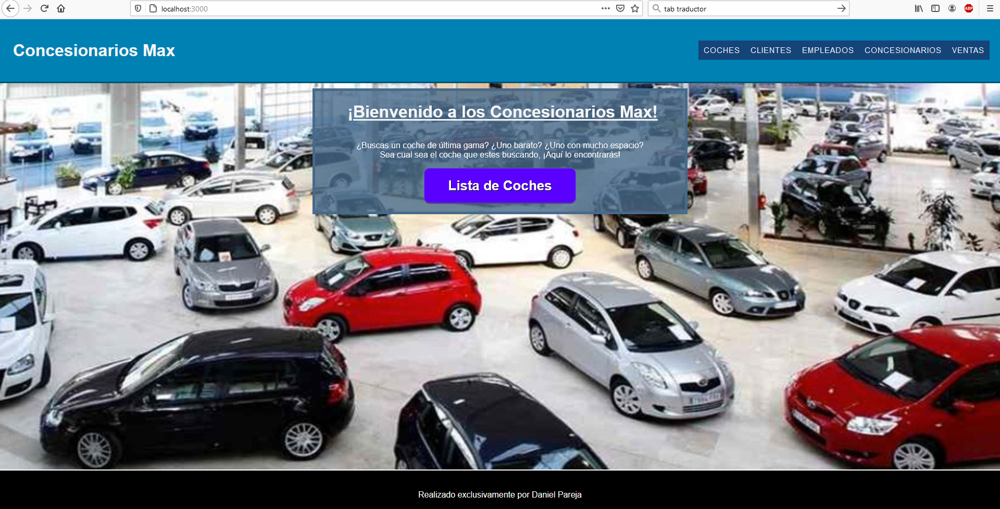
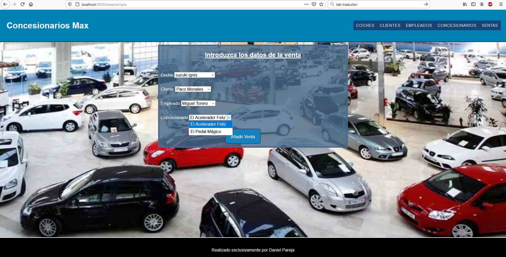

# ¿Que vas a hacer?

Este proyecto consiste en una página web que maneja una cadena de concesionarios.
Esta página gestiona las tiendas, los empleados, los clientes y los coches.
También recopila información sobre la venta de vehículos: Que vehículo compró el cliente, cual fue el cliente, en que tienda se vendió el coche, que encargado le vendió al cliente el coche...
La empresa tiene una política por la cual los empleados van periódicamente rotando de establecimiento, por lo que puede aparecer el mismo empleado en diferentes tiendas.
Cada tienda está ubicada en una ciudad, aunque una ciudad puede tener más de una tienda, por lo que para reconocerlas, cada tienda tiene su propio nombre. Además, cada tienda está dirigida por un gerente, el cual es uno de los empleados de la tienda. Cada tienda tiene un solo gerente y cada empleado solo puede ser gerente de una sola tienda.

## Las tablas y sus variables

- Coche: id, nombre, fabricante, anno_fabricacion, precio, plazas y foto.
- Cliente: id, nombre, dni y fecha_registro.
- Empleado: id, nombre, fecha_nacimiento, dni, ciudad_natal y fecha_contratacion.
- Tienda: id, nombre, ciudad, anno_construccion y gerente.
- Compra: id, coche, cliente, empleado, tienda y fecha.

## Páginas

- Al llegar el usuario a nuestra web, empezará en la página de inicio. Esta página saludará al usuario y tendrá un botón con la lista de coches disponibles y su información.
- En la ficha de cada coche verás un botón que llevará a un formulario para modificar sus datos. También verás un botón que al pulsarlo eliminará el coche de la BBDD.
- En la cabecera de la página web verás enlaces que llevan a las listas de coches, clientes, empleados, tiendas y compras.
- Las listas de empleados, clientes, tiendas y compras también tienen los botones para modificar y eliminar los datos de ese componente.
- Cada una de las 5 listas deben también incluir un botón que lleve a un formulario que permita crear un nuevo registro en esa tabla en particular. En el caso de cliente, empleado y compra, usaras como fecha de inscripción/contratación/compra la fecha en actual, por lo que no aparecen dichas variables entre los campos a rellenar de sus formularios.

## Técnología usada

- Este es un proyecto Monorepo, con carpetas "servidor" y "clientes".
- Para montar la BBSS usamos SQL. La Base de Datos es activada mediante postgresql. Las tablas que utilizamos y sus variables pueden verse en el fichero "tienda.sql".

## Instalación

1. Al descargarte el proyecto, el primer paso es activar postgresql, para lo cual abrimos nuestro terminal y escribimos "sudo service postgresql start".
2. Lo siguiente es introducir en la BBDD las tablas que necesitarás, por lo que escribe en tu terminal "psql -d (nombre de tu BBDD)" para entrar en el modo SQL e introduce las tablas y valores que aparecen en el fichero "tienda.sql".
3. Renombra base_ejemplo.js a base.js y modifica sus datos para que se conecte con tu terminal SQL.
4. Abre una 2ª pestaña en tu terminal. En una de las pestañas escribirás "yarn workspace server start" y en la otra "yarn workspace server start". Si todo va bien, debería abrirse el navegador web con la página de la cadena de concesionarios.

### Capturas de pantalla

